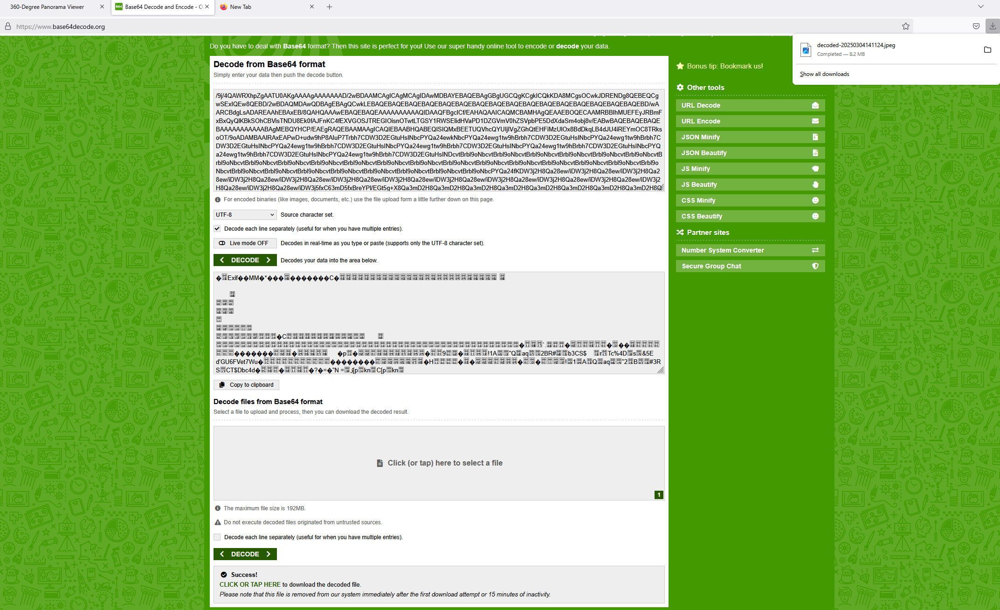
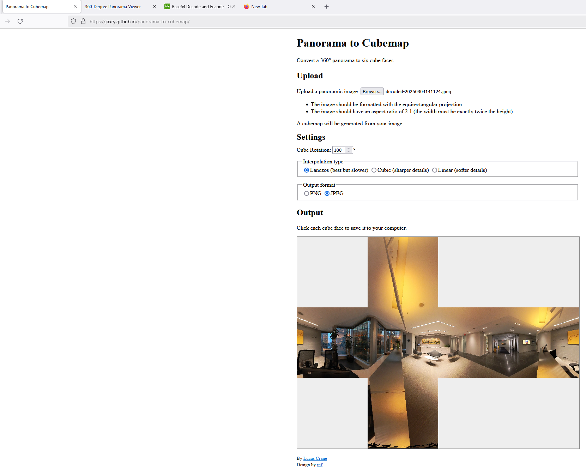
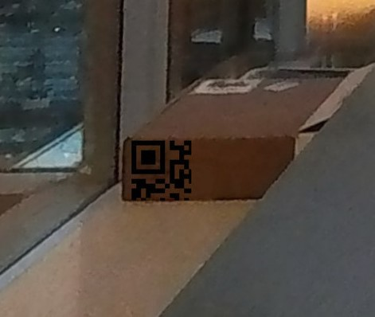
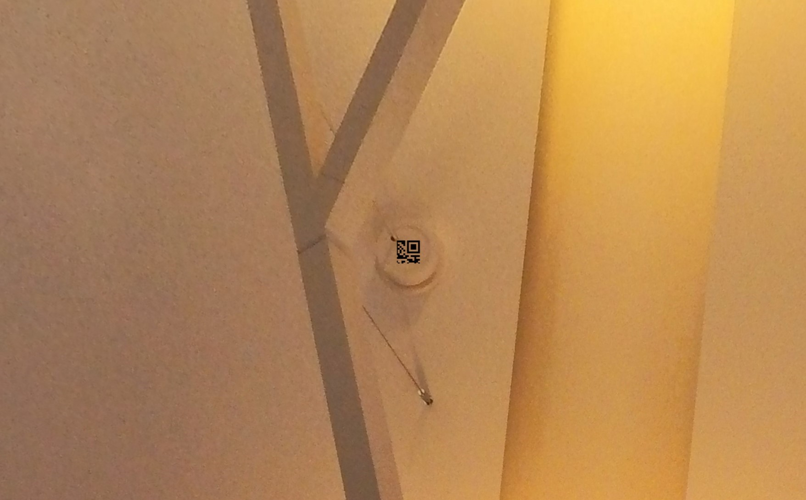
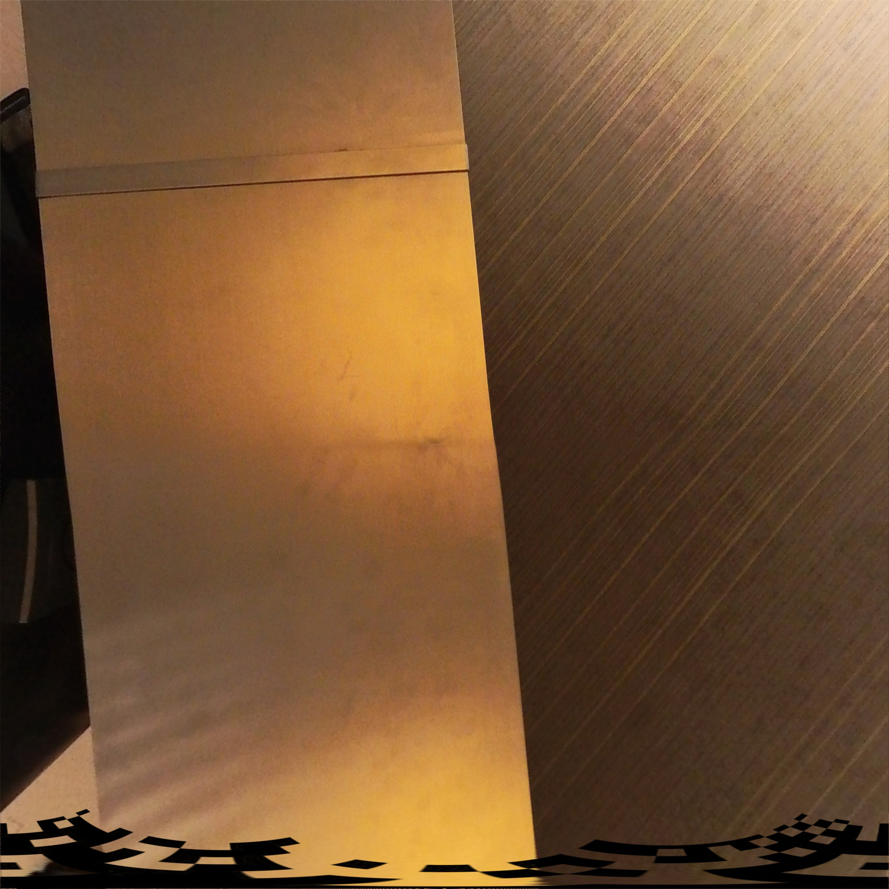
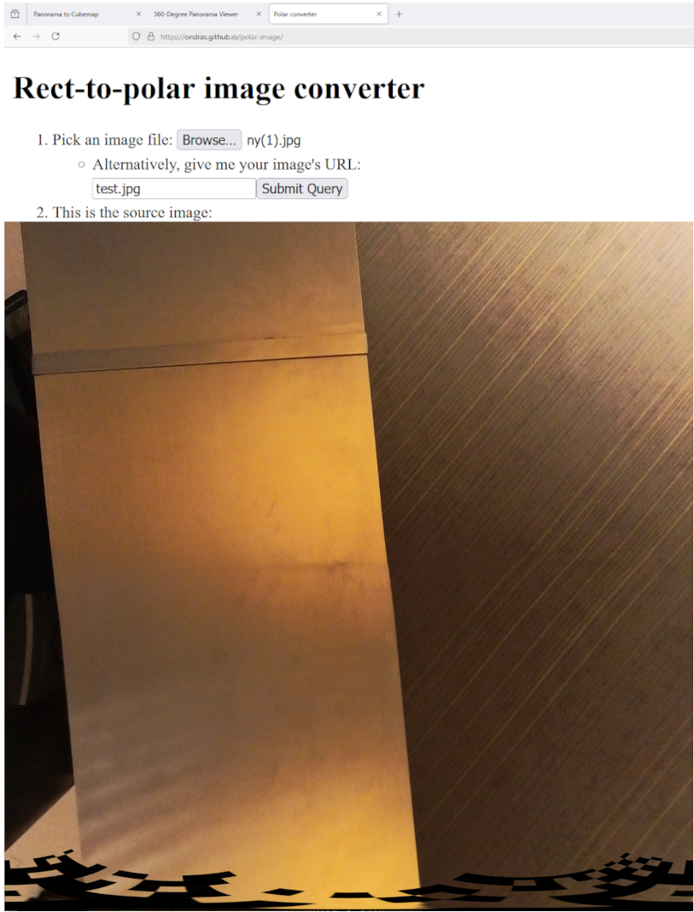
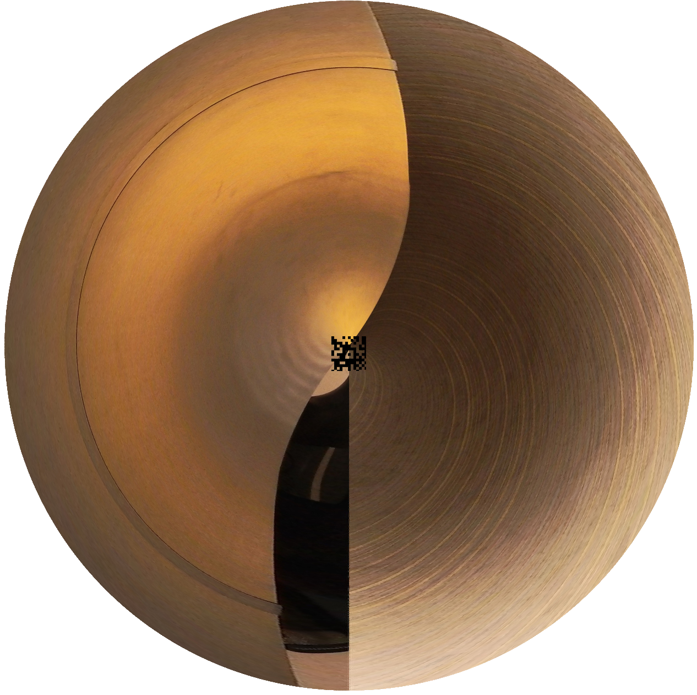
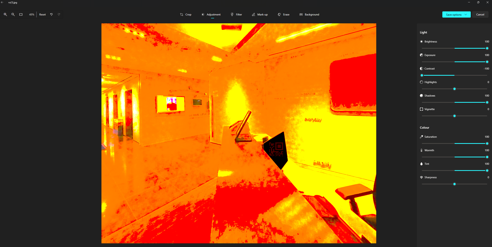
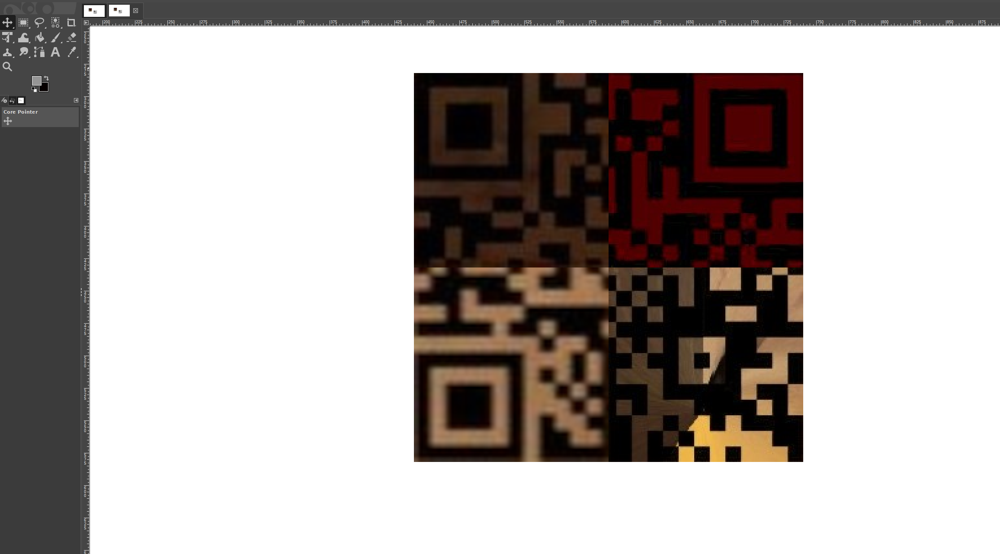
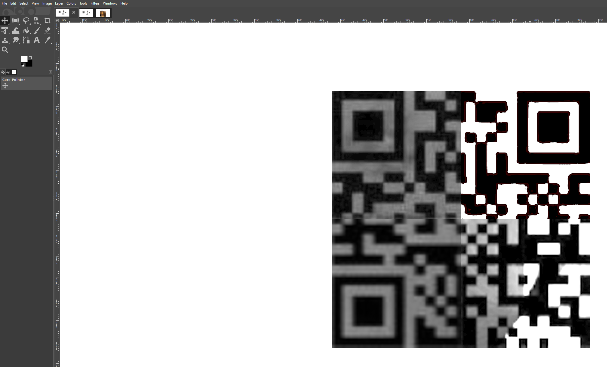

This challenge revolved around reconstructing a QR code that had been split into four fragments and embedded within a 360-degree panoramic image (captured by the team at Interac). My motivation behind this challenge was to revamp the Steganography category in CTFs, as it often carries a bad reputation. To make it more engaging, I designed it as a Steganography-OSINT hybrid challenge, incorporating elements of equirectangular projections—a format commonly used in Google Street View to allow users to inspect an image as if they were physically present in the scene.

After several iterations, I settled on an approach that was both solvable and technically rewarding. I chose a QR code as the central element of the challenge because of its iconic and recognizable structure, making it easy for beginners to infer the flag format from the start.

However, simply embedding a fragmented QR code wasn't enough. I had to ensure that players couldn't partially reconstruct the flag and obtain it prematurely. To prevent this, I first generated a QR code with the lowest possible redundancy setting to minimize error correction. Then split it into four separate pieces so that even if a portion was reconstructed, it wouldn't scan correctly. Finally, I made the white pixels transparent using GIMP, preventing players from easily piecing the fragments together using contrast adjustments alone.

These design choices forced players to fully reconstruct the QR code rather than relying on shortcuts, ensuring the challenge required actual problem-solving and technical skill.

### **Step 1: Understanding the Challenge and Avoiding the "Easy Route"**

The first task was identifying the flag format, which I deliberately hinted at by leaving two QR code fragments untouched—guiding players toward the correct approach. Initially, I considered leaving all four pieces unaltered, but I realized that players might simply hand-draw the entire QR code to extract the flag, which would have been dull and unrelated to programming. To prevent this, I took a calculated risk and applied a distortion function to one of the fragments, ensuring that solving the challenge required technical knowledge rather than artistic patience. I was also relieved to see that some players successfully figured out the correct transformation for the distorted piece. Props to those who, despite my attempts to discourage it, still painstakingly reconstructed it by hand. I was very impressed by your patience!

### **Step 2: Preventing Screenshot-Based Assembly**

Another potential shortcut was screenshotting each QR piece and reconstructing them manually. To counter this, I designed the challenge so that:

    In the interactive 360-degree view (Pannellum script), the QR fragments were placed at slightly skewed angles.
    In the equirectangular (flat) projection, distortions further prevented easy reconstruction.

This forced players to properly extract and align the fragments, rather than relying on simple image stitching.

### **Step 3: The Cubemap Conversion Trick**

To embed the QR fragments in a way that would challenge players:

    I converted the panoramic image into a cubemap format (a set of six square images representing a cube).
    I placed each QR fragment on a different cube face, converted the white pixels to transparent ones, and applied other edits which I will explain below.
    The image was then reconverted into an equirectangular projection, disguising the placement of the QR pieces.

Additionally, to prevent direct file extraction, I base64-encoded the image and inserted it into the panorama attribute of the Pannellum script.

Thus, the next step was for players to decode the base64 string to retrieve the raw image file, allowing them to analyze it more effectively.

### **Step 4: Recognizing the Projection Distortion**

Upon obtaining the flat (equirectangular) version, players would notice that some QR fragments were still tilted or distorted. The key realization was that:

    The image format was incorrect for direct extraction.
    Reverting the equirectangular image back into a cubemap format was necessary to retrieve the pieces in their original form.

.jpg)
.jpg)
.jpg)
.jpg)
.jpg)
.jpg)

### **Step 5: Retrieving the Undistorted Pieces**

Once converted to a cubemap, players could start identifying the QR code fragments:

    The first two pieces (75x75 and 50x50) were easy to extract and place.
    Aligning the side pixels (which were cut in half) helped determine the correct positioning.

The distorted fragment (bottom face of the cube) required an additional rectangular-to-polar transformation to restore it to its original shape.

The final piece was camouflaged on a computer monitor. I carefully blackened the screen, converting the black pixels to dark red while keeping the white pixels transparent. I hesitated to hide it this way, but I truly wanted to emphasize that Steganography challenges require more than just looking with the naked eye—players needed to adjust brightness, contrast, and saturation to reveal it.

### **Step 6: Reassembling the QR Code**

With all four pieces recovered, players had to:

    Scale the first and second pieces to 150x150 pixels.
    Assemble the fragments correctly.
    Convert the QR code to black and white.

GIMP proved to be the fastest tool for this process:

    Scaling can be done via the "Layer" tab.
    Color replacement (for adjusting the red-black QR piece) is available in the "Colors" tab.
    Reducing saturation and increasing exposure helped enhance clarity for the final piece.

By carefully following these steps, players could successfully reconstruct the QR code and retrieve the flag without having to manually paint anything! The best part was that there were online tools for most of the complex conversions that you could run in under 1-2 minutes.

---

## Tools, Sites, & Techniques
### **Tools Used in the Solve Phase**
1. **Fred's ImageMagick Scripts**:
   - Website containing many image-related scripts including ones for converting between spherical panoramas and cubemap formats. (http://www.fmwconcepts.com/imagemagick/index.php)
2. **GIMP**:
   - For editing QR code pieces and embedding them into cubemap faces. (https://www.gimp.org/downloads/)
3. **Microsoft Paint**:
   - For whitening the transparent pixels of a QR code piece. (https://apps.microsoft.com/detail/9pcfs5b6t72h?hl=en-us&gl=US)
4. **Pannellum**:
   - Lightweight, free, and open source panorama viewer for the web. Built using HTML5, CSS3, JavaScript, and WebGL, it is plug-in free. (https://pannellum.org/)
5. **Base64 Decode and Encode - Online**:
   - (https://www.base64decode.org/)
6. **Panorama to Cubemap**:
   - (https://jaxry.github.io/panorama-to-cubemap/)
7. **Rect-to-polar image converter**:
   - (https://ondras.github.io/polar-image/)

---

## Acknowledgments
This CTF challenge was inspired by the intersection of steganography, 360-degree imaging, and creative problem-solving. Special thanks to open-source tools like Linux, ImageMagick, GIMP, 
Pannellum, as well as Microsoft Paint, Microsoft Photos, Base64Encoder, Canva, PolyHaven, Base64 Decode and Encode - Online, jaxry's panorama to cubemap converter, ondras' Rect-to-polar image converter, and Fred Weinhaus's "free of charge for non-commercial (non-profit) use, ONLY" ImageMagick scripts for allowing the workflow to be seamless.

---

**Prepared by:** Serban Alin Caia
**Date:** 2025/03/29
